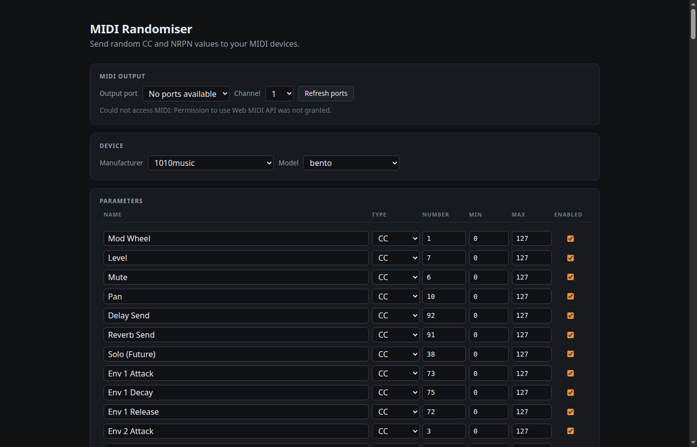

# MIDI Randomiser

A small web application for sending random CC and NRPN values to MIDI devices.

Live at <https://llozd.github.io/midi-randomiser/>

Pick your synth, choose which parameters to include, and hit **Randomise** to
send a fresh random value to every enabled one.

Several hundred instruments are covered, using the
[MIDI Guide dataset](https://github.com/pencilresearch/midi) maintained by
Pencil Research. The device list rebuilds itself from that dataset, so it stays
current without anyone maintaining it here.



## Requirements

- A Chromium-based browser (Chrome, Edge, Brave). MIDI output uses the Web MIDI
  API, which is not available in Firefox or Safari.
- The browser asks permission the first time the page requests MIDI access. The
  app can't list output ports until it is granted.

## Running locally

The app is plain static files, but the device data is generated rather than
committed, so it needs building once:

```bash
npm install
npm run devices    # clones the dataset, writes devices/generated/
```

Then serve the folder over HTTP and open it in Chrome/Edge:

```bash
npx serve
# or
python3 -m http.server
```

## Development

See [CONTRIBUTING.md](CONTRIBUTING.md). If a device is missing or wrong, the
fix goes to
[the dataset](https://github.com/pencilresearch/midi), not here.

## Licence

The application is MIT licensed - see [LICENSE](LICENSE).

The device data is from
[MIDI Guide](https://midi.guide/) by Pencil Research, used under
[CC BY-SA 4.0](https://creativecommons.org/licenses/by-sa/4.0/) and converted
from CSV to JSON. See [devices/NOTICE](devices/NOTICE) for what the conversion
changes.
